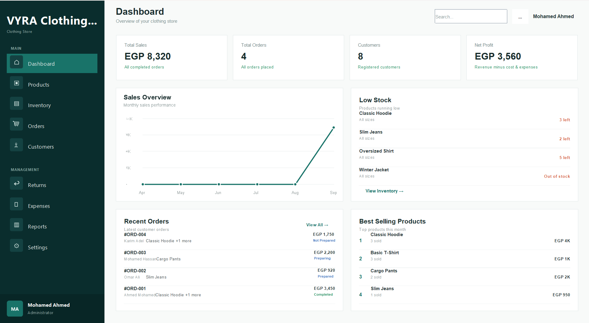
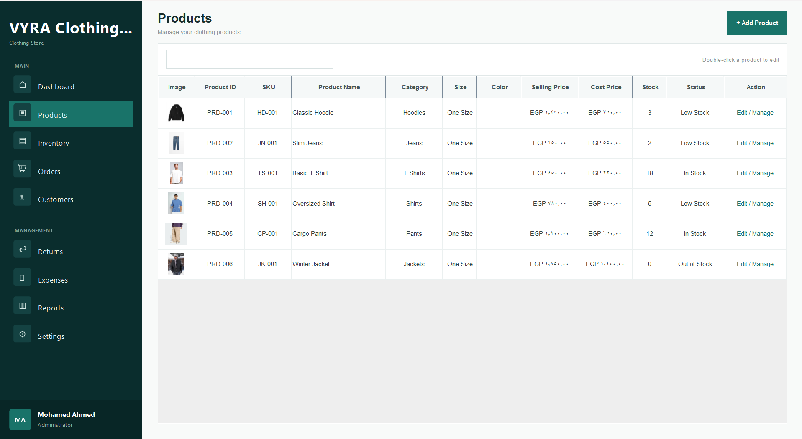
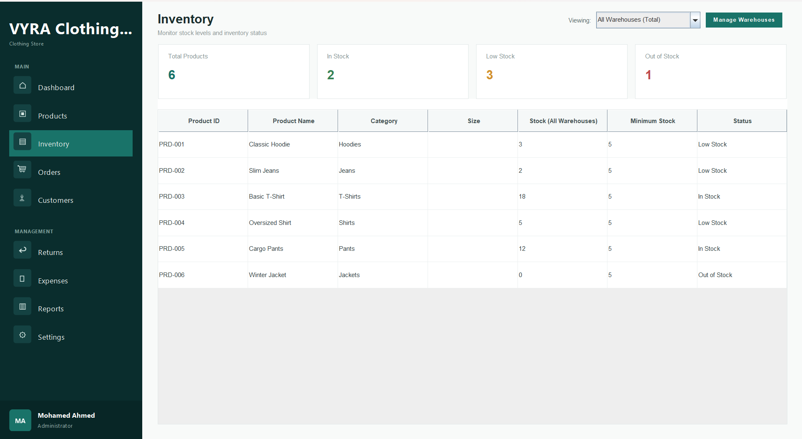
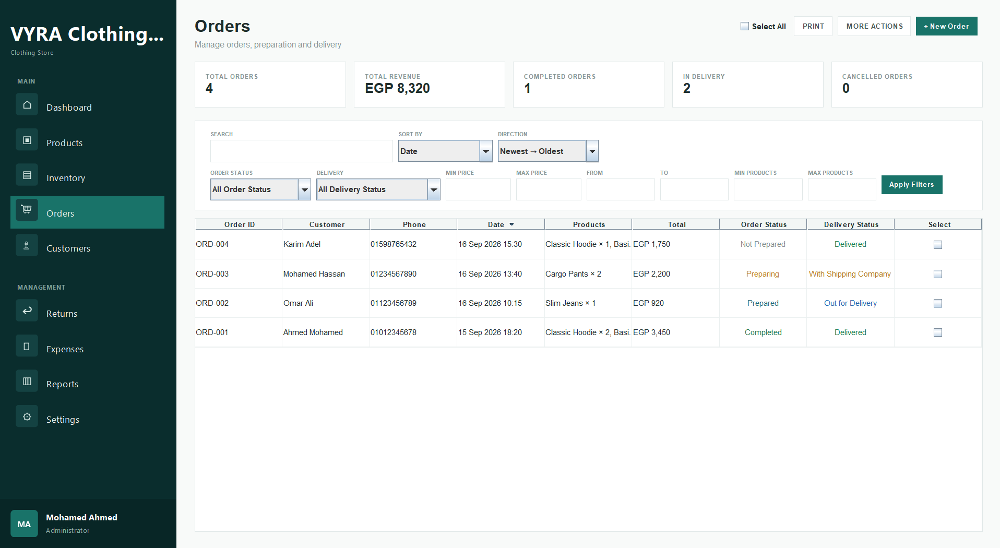
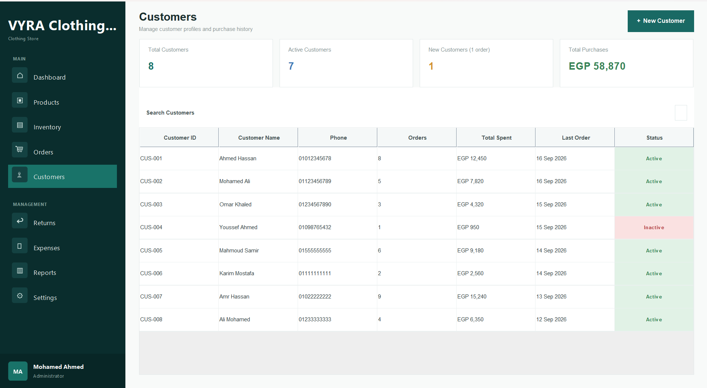

# Clothing Store Management System

A desktop management system designed for clothing stores to manage products, inventory, orders, customers, returns, expenses, and business reports from one application.

The system was built from the ground up with a focus on practical business workflows and a clean desktop user interface.

---

## 📸 Screenshots

### Dashboard



### Products



### Inventory



### Orders



### Customers



### Returns & Exchanges


### Expenses


### Reports


---

## ✨ Features

### Product Management

* Create and manage products
* Product categories
* Product pricing
* Product cost tracking
* Product images
* Stock tracking
* Product activation/deactivation

### Product Variants

* Size and color variations
* SKU management
* Variant-specific stock
* Variant-specific pricing
* Individual variant identification

### Inventory Management

* Stock tracking
* Inventory adjustments
* Stock movement history
* Warehouse inventory
* Stock updates connected to sales and returns

### Order Management

* Create and manage orders
* Customer orders
* Multiple products per order
* Product and variant selection
* Order totals
* Order status management
* Historical product and price information

### Returns & Exchanges

* Process product returns
* Track returned quantities
* Restock returned products
* Handle damaged returns
* Return history

### Customer Management

* Customer profiles
* Customer information
* Order history
* Customer-related business records

### Expense Management

* Record business expenses
* Track expense amounts
* Expense categories
* Expense history

### Reports

* Sales information
* Expense summaries
* Profit-related information
* Inventory information
* Business performance data

### Dashboard

* Business overview
* Key performance information
* Sales and order statistics
* Inventory overview

### Invoice / Printing

* Order invoice generation
* Customer information
* Product and order details
* Printable order information

---

## 🛠️ Tech Stack

* **Java**
* **Java Swing**
* **Eclipse**
* **Object-Oriented Programming**
* **Local Data Storage**

---

## 🏗️ Architecture

The system is organized around separate business modules including:

```text
Authentication
     │
     ▼
Dashboard
     │
     ├── Products
     │      └── Variants
     │
     ├── Inventory
     │      └── Warehouses
     │
     ├── Orders
     │      └── Customers
     │
     ├── Returns & Exchanges
     │
     ├── Expenses
     │
     └── Reports
```

The system was developed as a modular desktop application so that business operations are connected instead of being handled as isolated screens.

---

## 🎯 Project Goals

The main goal was to build a practical management system for clothing businesses rather than a simple CRUD application.

The system focuses on connecting:

**Products → Inventory → Orders → Customers → Returns → Expenses → Reports**

This allows business operations to work together within a single application.

---

## 💡 Key Business Workflows

### Selling a Product

```text
Product
   ↓
Variant Selection
   ↓
Order
   ↓
Stock Update
   ↓
Order History
```

### Returning a Product

```text
Existing Order
   ↓
Return
   ↓
Quantity Validation
   ↓
Restock / Damaged
   ↓
Inventory History
```

### Business Reporting

```text
Orders
   +
Returns
   +
Expenses
   +
Inventory
   ↓
Business Reports
```

---

## 🖥️ Application Type

**Desktop Application**

Designed primarily for clothing stores and retail businesses that need a centralized system for managing daily operations.

---

## 🚀 Project Status

The project is a completed functional desktop application developed as a real-world business management project.

Future versions may expand the system with additional integrations and capabilities.

---

## 👨‍💻 Developer

**Mohamed Ahmed**

Software Developer focused on building practical business systems and digital products.

---

## 📌 Note

This repository contains a portfolio version of the project.

All screenshots and example business data are for demonstration purposes.
